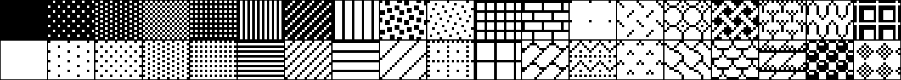

# Classic Mac Desktop Patterns

The 38 original 8×8-pixel black and white patterns from Macintosh System 1 Control Panel and MacPaint, extracted from the PAT# resource in the System file.



## Web Viewer

Visit <a href="https://paulsmith.github.io/mac-desktop-patterns/">https://paulsmith.github.io/mac-desktop-patterns/</a> to browse and download patterns.

## Formats

Patterns are available in multiple formats and resolutions:

- **PBM**: Original NetPBM format (8×8)
- **PNG, GIF, WebP, AVIF, TIFF, ICO**: 8×8, 16×16, 32×32, 64×64
- **Archives**: ZIP files by format and resolution

## Building

Get a System file from a System 1 through 6 disk. (See this [blog
post](https://pauladamsmith.com/blog/2025/08/classic-mac-patterns.html) for
details.) Extract patterns from System file:

```bash
$ DeRez -only PAT\# System > patterns.r
$ uv run extract.py patterns.r --outdir patterns
```

Generate web assets:

```bash
./generate_assets.sh
```

## Pattern Data

38 patterns total, numbered 0-37. Each pattern is 8 bytes representing an 8×8 pixel bitmap.

Source: Macintosh System 6 (patterns unchanged since System 1.0, 1984).
